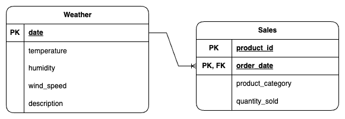

# Weather Sales Analysis

## Architecture Design

### Weather Data Collection
- Weather information is retrieved for each sales date by executing the [extract_historical_weather_data.py](scripts/extract_historical_weather_data.py), which calls the [OpenWeather Weather data for timestamp API](https://openweathermap.org/api/one-call-3#:~:text=a%20local%20language.-,Weather%20data%20for%20timestamp,-To%20learn%20about)
- Data includes metrics such as temperature, humidity, wind speed and description.
- Separate CSV files are generated for Melbourne and Sydney to ensure location-specific granularity and easier downstream data partitioning.

### Storage in Google Cloud Storage (GCS)
All generated CSV files are uploaded to a structured path in Google Cloud Storage (GCS).

- Acts as a centralised staging area for raw data.
- Supports scalable, cost-effective, and durable storage.
- Enables decoupling of data generation and loading processes.
- Provides native integration with BigQuery, allowing for efficient and automated data ingestion.

### Loading into BigQuery
Data from the CSV files in GCS is imported into BigQuery using [BigQuery’s native CSV ingestion mechanism](https://cloud.google.com/bigquery/docs/loading-data-cloud-storage-csv).

Each file is mapped to a corresponding BigQuery table in the [sales_weather_analysis dataset](https://console.cloud.google.com/bigquery?referrer=search&authuser=1&hl=en&inv=1&invt=AbxnTg&project=deft-approach-459711-g2&ws=!1m14!1m4!1m3!1sdeft-approach-459711-g2!2sbquxjob_9648076_196dd8b04d2!3saustralia-southeast1!1m4!4m3!1sdeft-approach-459711-g2!2ssales_weather_analysis!3sweather_data_syd!1m3!3m2!1sdeft-approach-459711-g2!2ssales_weather_analysis):
- ProductSalesByDate.csv → sales_data
- weather_data_mel.csv → weather_data_mel
- weather_data_syd.csv → weather_data_syd

### Daily Updates of Weather Data

The [update_weather.py](scripts/update_weather.py) script is responsible for fetching current-day weather data at current timestamp and inserting the retrieved data into the appropriate BigQuery weather table

For security purposes, API key is protected and not exposed within the code, it is stored in [Google Secret Manager](https://console.cloud.google.com/security/secret-manager/secret/openweather-api-key/versions?authuser=1&hl=en&inv=1&invt=AbxsJw&project=deft-approach-459711-g2) and provides audit logs to track when and whom accessed the secret

The script is containerised using a Dockerfile, and a Docker image is built and uploaded to Google Artifact Registry.

This provides consistency and ease of execution of the script:
- Simplicity: all dependencies are bundled together into an isolated
- Scability: the script is deployable as a Cloud Run job or other GCP service
- Versioning: maintains versioned docker images for better traceability and rollback

A [Cloud Run Job](https://console.cloud.google.com/run/jobs/details/australia-southeast1/daily-weather-update/executions?authuser=1&hl=en&inv=1&invt=AbxsJw&project=deft-approach-459711-g2) is configured to execute the containerised script. Some of the advantages include:
- Serverless: No infrastructure management -> it will scale to zero when idle
- Event-driven: Can be easily triggered for one-off or scheduled jobs e.g. Cloud Scheduler
- IAM-integrated: Fine-grained permissions using service accounts

A [minimal-privilege service account](https://console.cloud.google.com/iam-admin/serviceaccounts/details/111238670720876796289?authuser=1&hl=en&inv=1&invt=Abxr5g&project=deft-approach-459711-g2) is created specifically for the job and assigned the following roles:

| Role                                  | Purpose                                                        |
|---------------------------------------|----------------------------------------------------------------|
| roles/run.invoker                     | Allows Cloud Scheduler to invoke the Cloud Run job.            |
| roles/secretmanager.secretAccessor    | Grants access to retrieve the API key from GSM.                |
| roles/bigquery.dataEditor             | Allows the script to insert/update data in BigQuery tables.    |

## Logical Design

### Weather Data
Primary Key (PK): `date`

Attributes:
- `temperature`
- `humidity`
- `wind_speed`
- `description`

This table stores daily aggregated weather data. Each row represents the weather for a single day.

### Sales Data
Primary Key (PK): Composite key of `product_id` and `order_date`

Foreign Key (FK): `order_date` references Weather Data `date`

Attributes:
- `product_category`
- `quantity_sold`

This table captures product sales at a daily level. Each row indicates how many units of a specific product were sold on a specific date.

### Relationships
There is a one-to-many relationship from Weather Data to Sales Data:
- One row in Weather Data (one day’s weather) can be associated with many rows in Sales Data (many product sales on that day).
- `order_date` in Sales Data acts as a foreign key pointing to date in Weather Data.