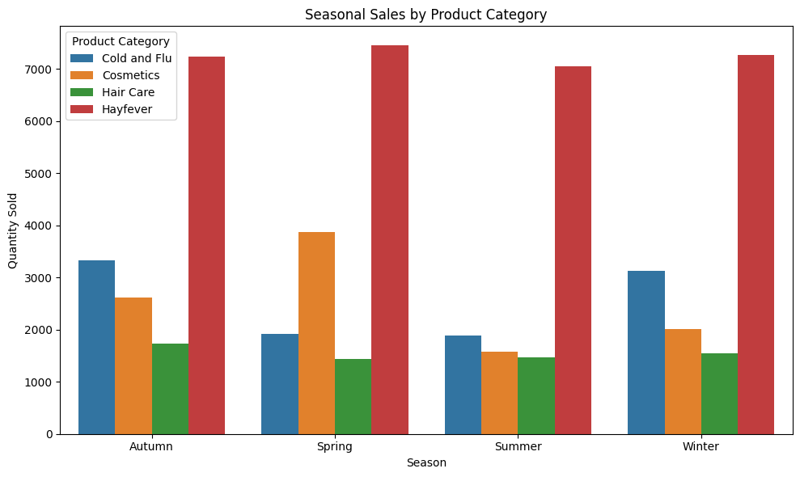

# Exploratory Analysis on Seasonal Trends in Product Sales vs Weather

## Insights

## Correlation Metrics against Quantity Sold for each Product Category

### Melbourne

#### Season: Summer

| Product Category | Temperature | Humidity  | Wind Speed |
| ---------------- | ----------- | --------- | ---------- |
| Cold and Flu     | -0.039200   | 0.085389  | 0.053350   |
| Hayfever         | 0.175852    | -0.041871 | -0.135276  |
| Hair Care        | -0.336097   | 0.365266  | -0.179821  |
| Cosmetics        | -0.190158   | 0.256476  | 0.009340   |

#### Season: Autumn

| Product Category | Temperature | Humidity  | Wind Speed |
| ---------------- | ----------- | --------- | ---------- |
| Cold and Flu     | -0.300276   | 0.106923  | 0.081134   |
| Hayfever         | 0.089934    | -0.009519 | 0.063393   |
| Hair Care        | -0.210094   | -0.150605 | 0.102638   |
| Cosmetics        | -0.456304   | 0.190040  | 0.054595   |

#### Season: Winter

| Product Category | Temperature | Humidity  | Wind Speed |
| ---------------- | ----------- | --------- | ---------- |
| Cold and Flu     | -0.195528   | 0.045655  | 0.082522   |
| Hayfever         | 0.074388    | -0.009160 | -0.026719  |
| Hair Care        | -0.233578   | -0.068649 | 0.148058   |
| Cosmetics        | -0.251431   | 0.037378  | -0.031015  |

#### Season: Spring

| Product Category | Temperature | Humidity  | Wind Speed |
| ---------------- | ----------- | --------- | ---------- |
| Cold and Flu     | 0.063521    | 0.090257  | -0.049406  |
| Hayfever         | -0.009032   | -0.158778 | -0.003439  |
| Hair Care        | 0.041104    | -0.163437 | -0.031495  |
| Cosmetics        | 0.160533    | 0.013524  | -0.130527  |

### Sydney

#### Season: Summer

| Product Category | Temperature | Humidity  | Wind Speed |
| ---------------- | ----------- | --------- | ---------- |
| Cold and Flu     | -0.115557   | 0.027045  | -0.234749  |
| Hayfever         | -0.079646   | 0.138087  | -0.068774  |
| Hair Care        | 0.037579    | 0.011694  | -0.328330  |
| Cosmetics        | 0.009683    | -0.017241 | -0.235325  |

### Season: Autumn

| Product Category | Temperature | Humidity  | Wind Speed |
| ---------------- | ----------- | --------- | ---------- |
| Cold and Flu     | -0.362500   | -0.106389 | -0.089776  |
| Hayfever         | 0.165683    | -0.002831 | -0.059700  |
| Hair Care        | -0.311374   | -0.106500 | 0.016532   |
| Cosmetics        | -0.324595   | -0.232989 | 0.039146   |

#### Season: Winter

| Product Category | Temperature | Humidity  | Wind Speed |
| ---------------- | ----------- | --------- | ---------- |
| Cold and Flu     | -0.180969   | -0.031988 | 0.093588   |
| Hayfever         | 0.037253    | -0.009174 | 0.061944   |
| Hair Care        | -0.092327   | 0.011907  | 0.034969   |
| Cosmetics        | -0.178536   | 0.084529  | 0.190555   |

#### Season: Spring

| Product Category | Temperature | Humidity  | Wind Speed |
| ---------------- | ----------- | --------- | ---------- |
| Cold and Flu     | -0.005760   | 0.106413  | -0.101602  |
| Hayfever         | 0.076210    | -0.368129 | -0.263680  |
| Hair Care        | -0.025953   | -0.353080 | -0.479380  |
| Cosmetics        | -0.008764   | 0.193380  | -0.332808  |

## Seasonal Insights on Product Sales

1. There is a negative correlation between Cold and Flu product sales and temperature during Autumn and Winter. This indicates that cooler temperatures coincide with increased demand for these products, which is line with typical flu seasonality. The correlation is much lower during warmer seasons such as Spring and Summer, which is also reflected by the lower sales numbers.

2. There is a positive correlation between Hair Care product sales and humidity during Summer. This suggests that increased humidity may drive higher demand for hair care products, possibly due to higher probability of hair frizz or damage. This pattern is less pronounced or negative in other seasons, highlighting it is a seasonal effect.

3. There is a consistent strong negative correlation with Cosmetics and temperature in autumn for both Melbourne and Sydney. This reflects that the lowering of temperature may drive higher cosmetic purchase to meet skincare needs, when it is drier and cooler. 
