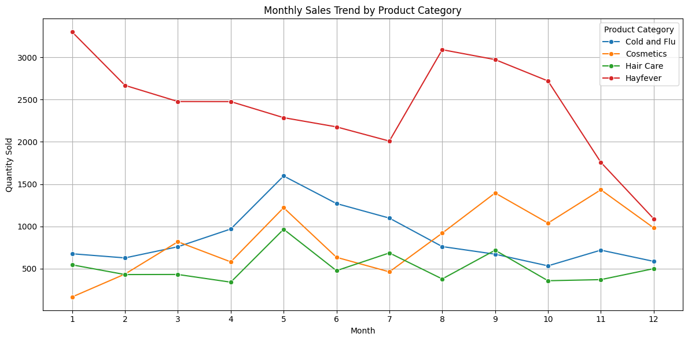

# Exploratory Analysis on Seasonal Trends in Product Sales vs Weather

## Insights

1. Cold and Flu products sell significantly more in Autumn and Winter, aligning with peak flu seasons.

2. Cosmetics perform best in Spring, likely due to increased social events or seasonal promotions.

3. Hayfever products have consistently high demand year-round, with a slight peak in Spring.

## Correlations between daily product sales and weather data

### Melbourne
1. Slight positive correlation with humidity (+0.05)
2. Negative correlation with temperature (-0.17) — suggesting sales increase slightly on colder days
3. No meaningful link with wind speed

### Sydney
Weak negative correlations across the board:
- Wind speed (-0.17)
- Temperature (-0.17)
- Humidity (-0.08)

